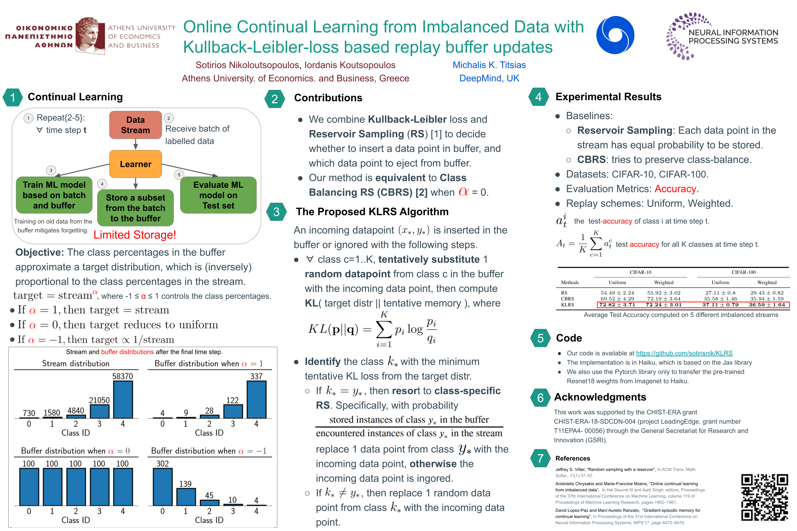
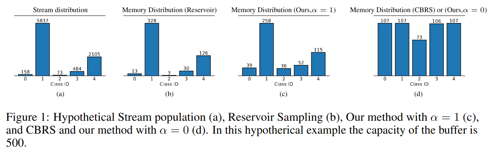

# Online Continual Learning from Imbalanced Data with Kullback-Leibler-loss based replay buffer updates

Source code for NeurIPS 2022 Workshop on Human in the Loop Learning.

## Poster



## Requirements

- Ubuntu 18.04 (OS)
- Anaconda3

To install requirements, first download Anaconda3:

```setup
wget https://repo.anaconda.com/archive/Anaconda3-2020.11-Linux-x86_64.sh
chmod +x Anaconda3-2020.11-Linux-x86_64.sh
sudo ./Anaconda3-2020.11-Linux-x86_64.sh
#place ananconda to /opt/ananconda3
cd /opt/ananconda3/bin/
./conda init bash
```

then run the following command to create the anaconda environment ( for cpu only, we will create a section for gpu when we upload the code to github):

```setup
conda env create -f mytf23.yml 
```

## Hardware Requirements
- We recommend a GPU with memory >= 6GB.

## Datasets
All datasets (MNIST,Fashion-MNIST,CIFAR-10,CIFAR-100) are downloaded automatically from our given code in main.py through the tensorflow_datasets library.

```run the prerun.py file to download all the datasets
python prerun.py 
```

## Training

First we will explain the basic setup of the input arguments:
- dataset_name (str): Dataset to use e.x. cifar10, cifar100, mnist, fashion_mnist
- inner_steps (int): Number of local gradient updates at the agent
- nn (str): The neural network arhitecture i.e. nn_default or resnet18
- agent_lr (float): Learning rate of agent
- local_buffer (str): The local buffer of the client i.e. klrs, cbrs, rs, nobuff
- local_buffer_size (int): The size of the local buffer
- replay_size (int): Number of data points for the replay batch
- replay_method (str): Replay scheme i.e. uniform, weighted
- batch_size (int): Number of received data points from the training stream per time step
- test_scenario (str): Original or imbalanced test set i.e. default or follow_the_stream
- kl_technique (str): Set the argument to "target" [KLRS only]
- kl_alpha (float): Alpha value for the target distribution [KLRS only]
- user_gpu (str): Add this argument only if you want to use a gpu, i.e. --use_gpu True

Use these commands to run the code:

First, activate the environment
```train
source activate mytf23
```

For GPU,

KLRS with CIFAR-100

```train
python -u main.py --local_buffer klrs --kl_technique target --kl_alpha -0.25 --local_buffer_size 2000 --batch_size 10 --replay_size 10 --inner_steps 5 --dataset_name cifar100 --agent_lr 0.01 --replay_method uniform --seed 1 --nn resnet18 --test_scenario follow_the_stream --use_gpu True
```

CBRS with CIFAR-100

```train
python -u main.py --local_buffer cbrs --local_buffer_size 2000 --batch_size 10 --replay_size 10 --inner_steps 5 --dataset_name cifar100 --agent_lr 0.01 --replay_method uniform --seed 1 --nn resnet18 --test_scenario follow_the_stream --use_gpu True
```

RS with CIFAR-100

```train
python -u main.py --local_buffer rs --local_buffer_size 2000 --batch_size 10 --replay_size 10 --inner_steps 5 --dataset_name cifar100 --agent_lr 0.01 --replay_method uniform --seed 1 --nn resnet18 --test_scenario follow_the_stream --use_gpu True
```

For CPU,

KLRS with MNIST

```train
python -u main.py --local_buffer klrs --kl_technique target --kl_alpha -0.2 --local_buffer_size 2000 --batch_size 10 --replay_size 10 --inner_steps 5 --dataset_name mnist --agent_lr 0.05 --replay_method uniform --seed 1 --test_scenario follow_the_stream
```

CBRS with MNIST

```train
python -u main.py --local_buffer cbrs --local_buffer_size 2000 --batch_size 10 --replay_size 10 --inner_steps 5 --dataset_name mnist --agent_lr 0.05 --replay_method uniform --seed 1 --test_scenario follow_the_stream
```

RS with MNIST

```train
python -u main.py --local_buffer rs --local_buffer_size 2000 --batch_size 10 --replay_size 10 --inner_steps 5 --dataset_name mnist --agent_lr 0.05 --replay_method uniform --seed 1 --test_scenario follow_the_stream
```

<!---
## Hypothetical example


-->
